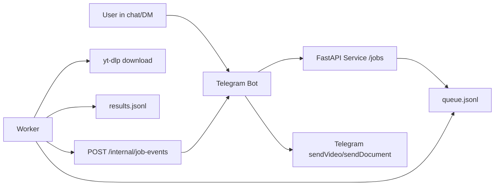
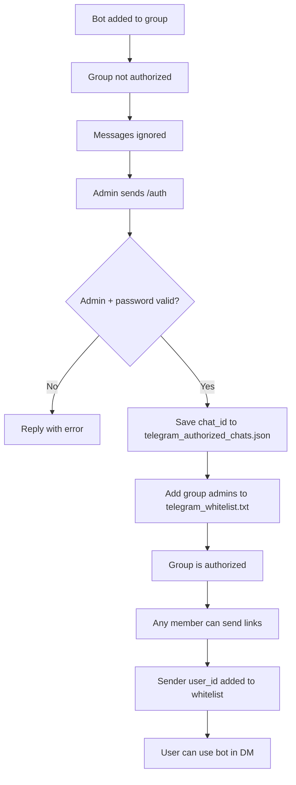
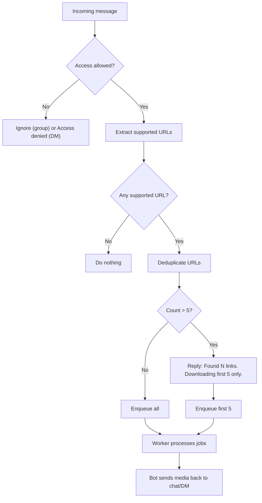

# ClipDrop

Telegram bot + queue service + worker for downloading links from:
- TikTok
- Instagram (`/reel/`, `/p/`, `/tv/`)
- X/Twitter (`/.../status/...`)

YouTube links (including Shorts) are ignored.

## Setup

```bash
uv sync
cp .env.example .env
```

## Run

```bash
uv run service --port 8011
uv run worker
uv run telegram-bot --service-url http://127.0.0.1:8011
```

Or run all together:

```bash
uv run stack --port 8011 --callback-port 8090
```

## Mermaid Diagrams

### System Flow



### Chat Authorization Flow



### Message Handling (with 5-link limit)



## API

### `POST /jobs`

```json
{
  "urls": ["https://x.com/user/status/123"],
  "subscriber": {
    "chat_id": 123456789,
    "message_id": 321,
    "chat_type": "group",
    "thread_id": null
  }
}
```

Returns list of jobs with dedup status.

### `GET /jobs/{job_id}`

Returns full job state including `subscribers_count`.

### `GET /health`

```json
{"ok": true}
```

## Callback endpoint (inside bot)

Worker sends `POST /internal/job-events` to bot callback server (default `127.0.0.1:8090`) with header:

`X-Internal-Token: <BOT_CALLBACK_SECRET>`

Bot enforces idempotency by `event_id`.

## Queue files

- `queue.jsonl`: append-only state snapshots per job
- `results.jsonl`: terminal states (`done` / `failed`)
- `telegram_authorized_chats.json`: authorized group/supergroup chat IDs
- `telegram_whitelist.txt`: user IDs allowed to use the bot in private chat

## Chat Authorization

1. Add bot to a group/supergroup.
2. Until authorized, bot ignores regular messages in that chat.
3. Group admin runs:

```bash
/auth 123
```

Rules:
- `/auth` works only in group/supergroup.
- Caller must be chat admin (`administrator` or `creator`).
- Password is checked against `TELEGRAM_AUTH_PASSWORD` from `.env`.
- On success:
  - current `chat_id` is persisted in `telegram_authorized_chats.json`,
  - current chat admins are added to `telegram_whitelist.txt`.

After chat authorization:
- Any member in that authorized chat can send supported links.
- Their user ID is automatically added to whitelist.
- In private chat, only whitelisted users can use downloader.
- Non-whitelisted users in private chat get `Access denied.`

## Notes

- Public content only in v1 (no cookies/auth flow).
- Bot is silent when message has no supported links.
- If a message contains more than 5 supported unique links, bot downloads only the first 5 and sends a notice.
- In groups, disable Telegram privacy mode in BotFather if you want bot to read all messages.

## Telegram upload limits and auto-resize

- `<= 50MB`: bot sends the original file (`sendVideo`, fallback to `sendDocument`).
- `> 50MB` and `<= 150MB`: bot notifies user, resizes with `ffmpeg` to fit Telegram Bot API limit, and sends resized output.
- `> 150MB`: bot notifies user that Telegram Bot API allows only up to 50MB and skips upload attempt.

Requires `ffmpeg` and `ffprobe` available in `PATH`.

User-facing messages:
- `Файл більший за 50MB. Стискаю до Telegram-ліміту, зачекайте.`
- `Файл дуже великий. Telegram Bot API дозволяє надсилати файли до 50MB, цей файл перевищує поріг для авто-стискання.`
- `Не вдалося стиснути файл до 50MB для відправки в Telegram.`

## Tests

```bash
uv run pytest
```
